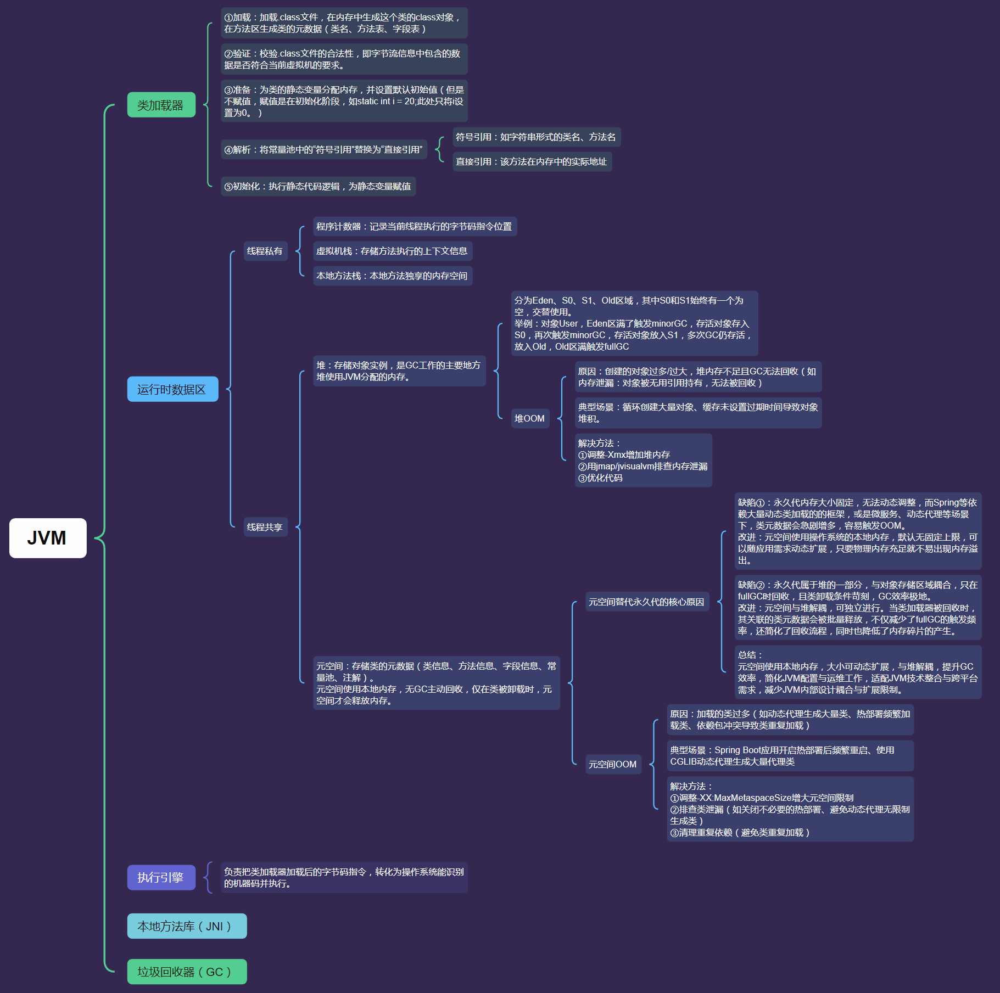

<!-- TOC -->

* [概要](#概要)
* [思维导图](#思维导图)
* [JVM五大组成：](#jvm五大组成)
    * [一、类加载器](#一类加载器)
    * [二、运行时数据区：](#二运行时数据区)
    * [三、执行引擎：](#三执行引擎)
    * [四、本地方法接口、本地方法库：](#四本地方法接口本地方法库)
    * [五、垃圾回收器(GC)：](#五垃圾回收器gc)

<!-- TOC -->

# 概要

JVM虚拟机是运行java字节码的虚拟进程，拥有多个核心组件。

- 主要能力为：
    - 提供跨平台能力：一次编写，到处运行。
    - 自动化内存管理：自动分配对象内存，通过GC释放无用对象，减少内存泄漏风险。

# 思维导图

---

# JVM五大组成：

---

## 一、类加载器

`类加载器的工作内容主要分为五个阶段：`

1. 加载：加载.class文件，在内存中生成这个class对象，在方法区生成类的元数据

2. 验证：校验.class文件的合法性，即字节流信息中包含的数据是否符合当前虚拟机的要求。

3. 准备：为类的静态变量分配内存以及默认值，但是不进行初始化（赋值）操作，如static int i = 20;在准备阶段只对i赋予默认值0。

4. 解析：将符号引用转换为直接引用。

5. 初始化：执行静态代码逻辑，为静态变量赋值。

---

## 二、运行时数据区：

`元空间根据其对于线程的使用类型可以分为两类：`

- 线程私有：
    - 程序计数器：记录当前线程正在执行的字节码指令地址。
    - 虚拟机栈：存储方法执行时的上下文信息。
    - 本地方法栈：存储本地方法执行时的上下文信息。

- 线程共享：

    - 堆：存储对象实例。堆分为Eden、Survivor0、Survivor1、Old区域。
    - 元空间：存储类的元数据。

- OOM问题：
    - 堆OOM：
        - 错误信息：java.lang.OutOfMemoryError: Java heap space
        - 原因：堆是存储对象实例的核心区域，当新对象无法分配内存且 GC 无法回收足够空间时，触发堆OOM。
        - 典型场景：
            1. 内存泄漏：对象被长期引用，无法GC。
            2. 对象生命周期过长：短生命周期对象被长生命周期对象引用（如缓存未设置过期时间）
            3. 堆参数设置过小：-Xmx（最大堆）设置远小于业务峰值内存需求。
            4. 大对象直接分配：一次性创建超大对象（如几 GB 的数组），堆空间不足
        - 解决方法：
            1. 增加堆内存，调整堆参数；
            2. 修复内存泄漏：清理无效引用（如集合 clear()、移除不再使用的缓存）
            3. 减少大对象生成：分批处理大数据，避免一次性创建超大数组或集合。
            4. 优化对象生命周期：使用弱引用（WeakReference）或软引用（SoftReference）存储缓存，让 GC 可回收
    - 元空间OOM：
        - 错误信息：java.lang.OutOfMemoryError: Metaspace
        - 原因：当类元数据总量超过元空间限制时触发元空间OOM。
        - 典型场景：
            1. 动态生成类过多：如频繁使用反射、动态代理（CGLib、JDK 代理）、字节码增强（ASM）生成大量类。
            2. 类加载器泄漏：自定义类加载器未被回收，导致其加载的类无法卸载（如 Tomcat 热部署时旧类加载器残留）。
            3. 第三方库加载大量类：如 Spring、Hibernate 等框架会动态生成大量代理类。
            4. 元空间参数设置过小：-XX:MaxMetaspaceSize 限制过严，或 XX:MetaspaceSize（初始阈值）设置不合理。
        - 解决方法：
            1. 调整元空间参数 -XX:MaxMetaspaceSize
            2. 减少动态类生成：缓存动态代理类（如 CGLib 设置 setUseCache(true)），避免频繁生成新类。
            3. 修复类加载器泄漏：确保自定义类加载器可被 GC 回收（如关闭 Tomcat 时清理旧类加载器引用）。
            4. 优化框架使用：如 Spring 减少不必要的 AOP 代理，Hibernate 避免动态生成过多 SQL 类。

---

## 三、执行引擎：

`JVM执行引擎负责将字节码转换成机器码，并执行机器码。`

---

## 四、本地方法接口、本地方法库：

`JVM提供本地方法接口，本地方法库，用于调用本地方法。`

---

## 五、垃圾回收器(GC)：

`主要负责堆的垃圾回收，Eden、S0、S1是新生代、Old是老年代。`

- Eden: 存放新生对象
- S0/S1: 存放一次minorGC后存活的对象
- Old: 存放一次majorGC后存活的对象

`GC分为minorGC、majorGC、fullGC：`

- minorGC：新生代GC，当Eden区域不足时触发，采用复制算法，存活的对象会移动到S0/S1区域，其中S0和S1这两个区域中交替使用。
- majorGC：老年代GC，当老年代空间不足或大对象直接放入老年代时分配失败触发，执行频率低，采用标记-整理算法、标记-清除算法、标记-复制算法（G1收集器）。
- fullGC：对新生代、老年代、元空间进行的完整垃圾回收。